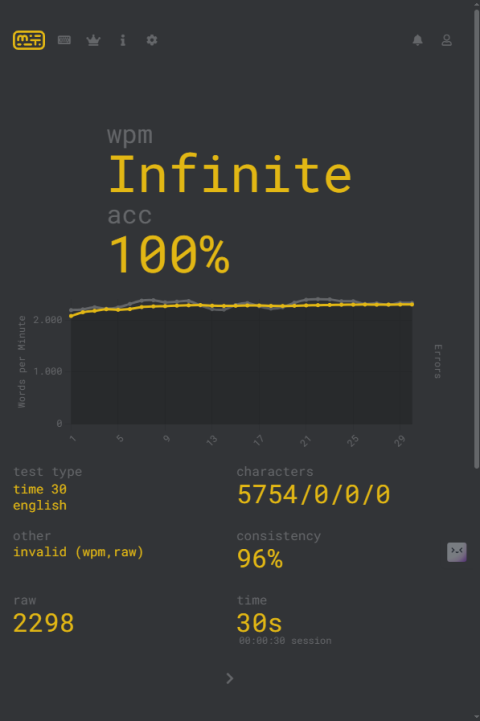
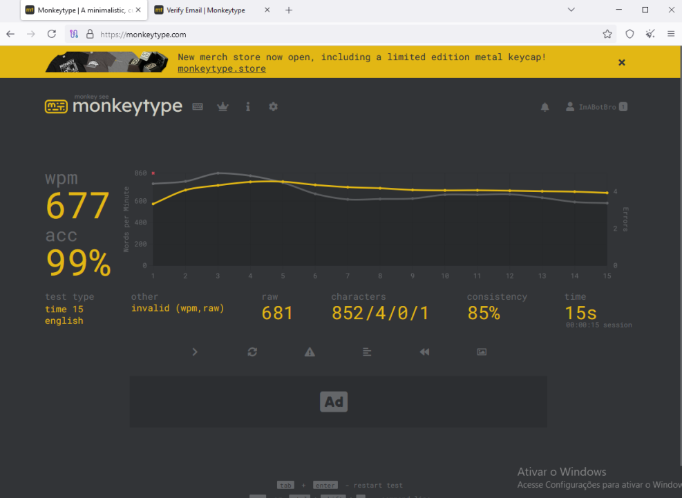

# Typing Bot

<p align="center">


</p>
Este é um script de alto desempenho para Tampermonkey, projetado para automatizar testes de digitação no site monkeytype.com. Ele utiliza um método inteligente e autocorretivo para alcançar a máxima velocidade e precisão, garantindo uma performance quase perfeita.
O projeto foi desenvolvido por etoshy como um exercício de programação e prova de conceito.
Resultados Obtidos
Resultados obtidos utilizando o bot no modo mais rápido (ultra):
<p align="center">
  
   
  
</p>

## Características Principais

-   🚀 **Velocidade Extrema**: Digita palavra por palavra de forma quase instantânea, com uma pausa mínima e configurável entre elas.
-   🧠 **Autocorreção Inteligente**: Detecta e corrige erros de digitação em tempo real, garantindo 100% de precisão e evitando que o bot "se perca".
-   ✅ **Fácil Instalação**: Pronto para usar com a extensão Tampermonkey, sem necessidade de configurações complexas.
-   🎮 **Controles no Console**: Permite iniciar, parar e ajustar a velocidade diretamente pelo console do navegador (`F12`).
-   ⚡ **Ativação Automática**: O script carrega e inicia automaticamente ao visitar o site [monkeytype.com](https://monkeytype.com/).

## Pré-requisitos

Para usar este script, você precisa de:

1.  Um navegador de internet (ex: Google Chrome, Mozilla Firefox, Microsoft Edge).
2.  A extensão **[Tampermonkey](https://www.tampermonkey.net/)** instalada no seu navegador.

## Instalação

Siga estes passos simples para instalar o bot:

1.  Certifique-se de que a extensão **Tampermonkey** já está instalada e ativa no seu navegador.
2.  **[CLIQUE AQUI PARA INSTALAR O SCRIPT](https://github.com/etoshy/typing-bot/raw/main/main.js)**  
    *(**Atenção:** Substitua `SEU-REPOSITORIO` pelo nome do seu repositório e `script.user.js` pelo nome do seu arquivo de script).*
3.  O Tampermonkey abrirá uma nova aba mostrando os detalhes do script. Clique no botão **"Instalar"**.
4.  Pronto! O script está instalado.

## Como Usar

1.  Acesse o site **[https://monkeytype.com/](https://monkeytype.com/)**.
2.  O bot iniciará automaticamente após um breve momento. Você verá as mensagens de inicialização no console do navegador (pressione `F12` para abrir).
3.  Para controlar o bot manualmente, abra o console e use os seguintes comandos:
    ```javascript
    // Para o bot
    typingBot.stop();

    // Inicia o bot novamente
    typingBot.start();

    // Muda a velocidade (5ms de pausa entre palavras)
    typingBot.ultra(); 

    // Muda para uma velocidade mais lenta e segura
    typingBot.safe(); 

    // Define uma velocidade personalizada (ex: 10ms)
    typingBot.setSpeed(10); 
    ```

## ⚠️ Aviso Importante

Este script foi desenvolvido e testado **exclusivamente para o site [monkeytype.com](https://monkeytype.com/)**. Ele pode não funcionar corretamente em outras plataformas de digitação.

O uso de bots para falsificar suas habilidades de digitação em competições ou rankings é considerado trapaça. Este projeto foi criado para fins educacionais. Use por sua conta e risco. O autor não se responsabiliza por quaisquer consequências negativas resultantes do seu uso.
